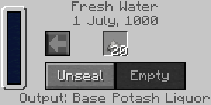
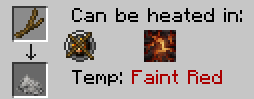
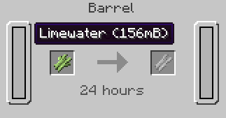
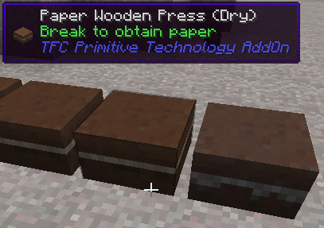
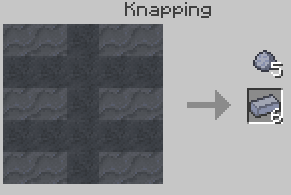
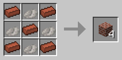
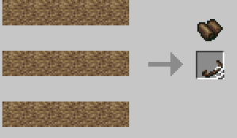
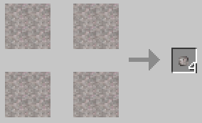

# TFCPrimtiveTechnologyPlus
This is a port for TFC+. All rights go to Wahazar and aleksey. This mod adds Slinghot and advanced leather and paper processing for use with TerraFirmaCraft.

Click [here](https://github.com/Wahazar/TFCPrimitiveTech) to view Wahazar's project

Below is a summary from the [forum page](https://terrafirmacraft.com/f/topic/9902-primitive-technology-tfc-add-on-mod/)
## Base potash liquor

Base potash liquor can be made by sealing at least 20 units of ash in barrel with fresh water (or 10 units in large vessel).
This mildly alkaline solution can be used for macerating raw hide or reeds.

Ash can be produced by heating wooden twig in firepit or forge:
The wooden twig is a product of crushing logs with a hammer. Another usage of twigs is to make stick or slingshot.

## Alternative processing of the raw hide

In TFC+, flux is a bottleneck not only for metalworks, but also for leather preparation. Exploring far lands without even leather protection is rather uneasiness.
Nowadays liming of hide in calcium hydroxide is a standard procedure, but in ancient times, other methods were in use, for example cleaning with ash, urine etc.

Thanks to this mod, if you doesn't found flux yet, you can macerate raw hide in base potash liquor, to achieve soaked hide. This process is less efficient than original with limewater, because potash liquor finally turns into waste.

## Ancient method of paper making

This mod replace simple reeds to paper recipe with process similar to ancient papirus production:

first, reeds must to be bleached and macerated in base potash liquor, to achieve cellulose fibers:

Secondly, 2 units of fibers and 2 wooden press plates are crafted together to achieve Wooden Press with wet paper pulp. This small block should be placed under the open sky, if exposed to sun more than 10 hours until dry, can be broken to achieve wooden press plates and paper leafs:

Left and center - dried, right: wet paper press, it works similar to mud brick from TFC Decorations mod (I borrowed some java code from this mod).

There is option to disable this recipe and use vanilla one.

## Ceramic bricks

For those who miss standard red bricks - you can make 6 soft brick from stack of 5 lump clay and place it in pit kiln, as other pottery items.

After smelting, you can combine each 5 bricks and 4 mortars into bricks blocks, similar to stone brick block recipe.

## Slingshot throwing stones

Bow is not accessible at early game stage, when player is most threatened by environment dangers. Even with bow, you cannot kill undeads such skeleton. Fair irritable, when such skeleton is occupying your pond, without ranged weapon you cannot even reach him due to his arrows knockback.

This mod offer primitive ranged weapon: slingshot, which use following types of ammunition:

hard stone (from any ingenous rock) - crushing damage
sharp stone (from any metamorfic rock) - slashing damage
soft stone (from any sedimentary rock) - no damage bonus, decreased force.

There is option to disable slingshots.

Slingshot is made from wooden twig and leather belt. Leather belt is made by carving horizontal stripe from leather (up to 3 belts from one leather):  

One rock can be knapped into 4 stones:  

## Wooden club (primitive mace)

Stone hammer is fragile and weak, you need few of them to defeat skeleton., is of course much worse than copper mace, but better than stone hammer. Ultimate tool, if you need to sweep old bones from your yard.

## Improved arrow recipe

TFC arrow recipe is overpowered (8 pieces), this mod change it to one arrow from feather, stick and flint. It also provide opportunity to utilise all these flint drops.

There is option to disable this recipe.
