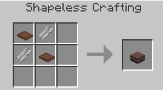
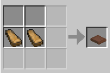
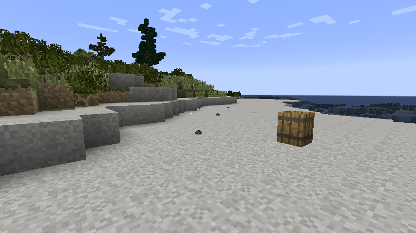
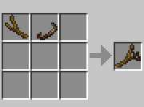
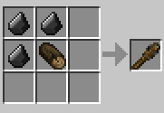

# TFCPrimtiveTechnologyPlus
This is a port for TFC+. All rights go to Wahazar and aleksey. This mod adds Slinghot and advanced leather and paper processing for use with TerraFirmaCraft.

Click [here](https://github.com/Wahazar/TFCPrimitiveTech) to view Wahazar's project  
The old [forum page](https://terrafirmacraft.com/f/topic/9902-primitive-technology-tfc-add-on-mod/) from Wahazar

## Ancient method of paper making

This mod replace simple reeds to paper recipe with process similar to ancient papirus production:

First, reeds must be bleached and macerated in limewater, this will give you cellulose fibers:

  
*10 buckets of limewater is needed for 64 reeds*

Two fibers and two wooden press plates are crafted together to 
get **Wooden Press with wet paper pulp**. This small block should be placed 
with direct sunlight.
The block will slightly change color to indicate that it's dry after 10 hours of exposed sunlight.
You will also notice that the paper inbetween is not a sludge anymore
When broken will drop your woodenpress and your newly created paper!

Recipes  

  

Left and center - dried, right: wet paper press, it works similar to mud brick from TFC Decorations mod (I borrowed some java code from this mod).

There is option to disable this recipe and use vanilla one.

## Slingshot throwing stones

This mod offers a primitive ranged weapon: the slingshot

The slingshot uses the following types of ammunition:
* Hard stone (from any ingenous rock) - crushing damage
* Sharp stone (from any metamorfic rock) - slashing damage
* Soft stone (from any sedimentary rock) - no damage bonus, decreased force.  
  
*Furthest is the Hard Stone, than Sharp Stone, than Soft Stone*  

There is an option to disable the slingshot.

Leather belt is made by carving horizontal stripe from leather (up to 3 belts from one leather)  
Slingshot is made from wooden twig and leather belt  

One rock can be knapped into 4 stones:  

## Wooden club (primitive mace)

Stone hammer is fragile and weak, you need few of them to defeat skeleton., 
is of course much worse than copper mace, but better than stone hammer. 
Ultimate tool, if you need to sweep old bones from your yard.

